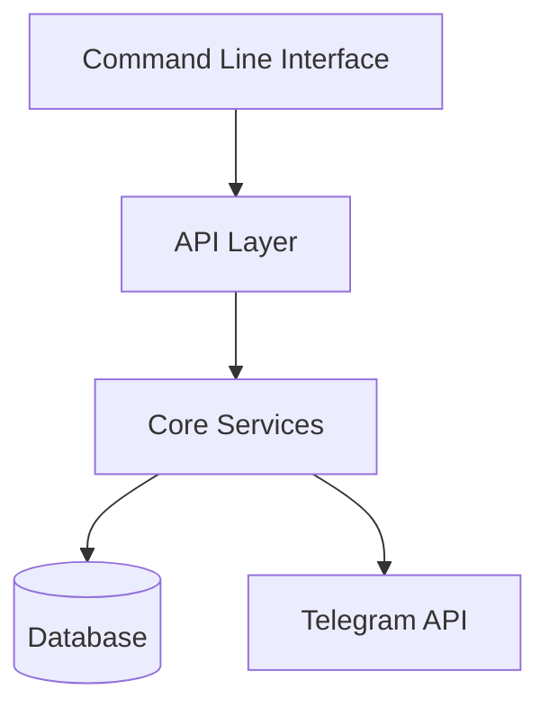
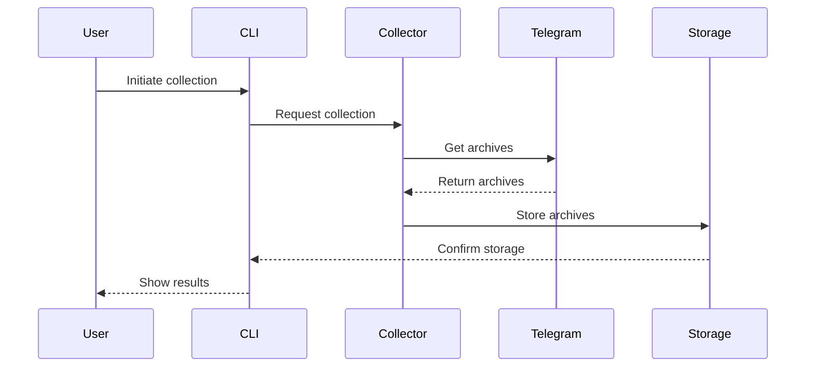
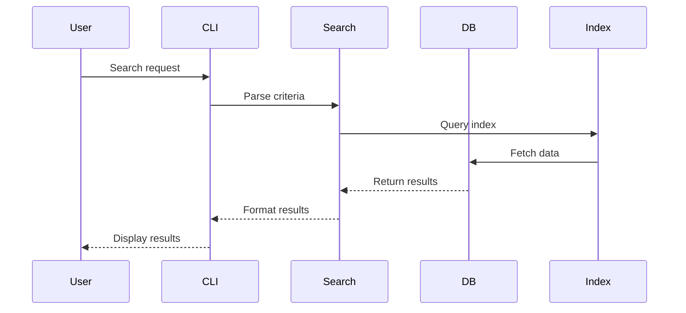
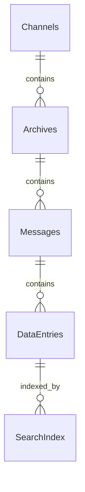
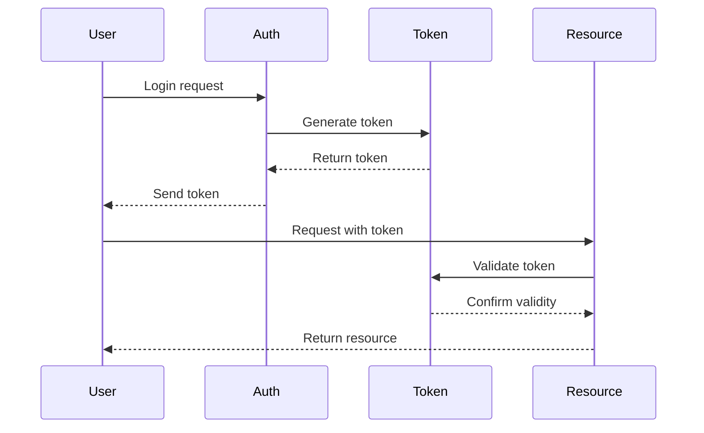
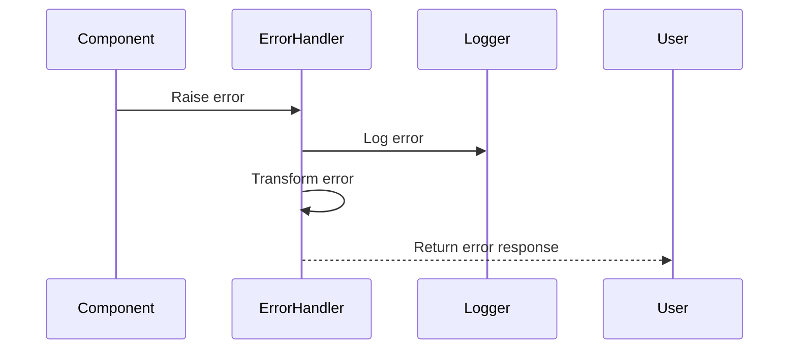
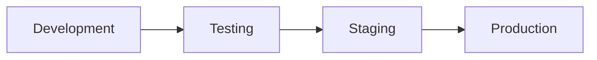

# Architecture Overview

## System Architecture

### High-Level Components


## Component Details

### Command Line Interface
- User input parsing
- Command routing
- Output formatting
- Error handling

### API Layer
- Request validation
- Authentication/Authorization
- Rate limiting
- Response formatting

### Core Services

#### Channel Manager
```python
class ChannelManager:
    """Manages Telegram channel operations."""
    def add_channel(self, channel_id: str) -> Channel
    def remove_channel(self, channel_id: str) -> bool
    def get_status(self, channel_id: str) -> ChannelStatus
    def list_channels(self) -> List[Channel]
```

#### Archive Collector
```python
class ArchiveCollector:
    """Handles archive collection from channels."""
    def collect_from_channel(self, channel: Channel) -> List[Archive]
    def collect_all(self) -> Dict[Channel, List[Archive]]
    def verify_archive(self, archive: Archive) -> bool
```

#### Data Processor
```python
class DataProcessor:
    """Processes collected archives."""
    def process_archive(self, archive: Archive) -> ProcessedData
    def extract_data(self, data: RawData) -> ExtractedData
    def validate_data(self, data: ExtractedData) -> bool
```

#### Search Engine
```python
class SearchEngine:
    """Handles data searching and indexing."""
    def search(self, criteria: SearchCriteria) -> SearchResults
    def index_data(self, data: ProcessedData) -> bool
    def optimize_index(self) -> bool
```

#### Scheduler
```python
class Scheduler:
    """Manages automated tasks."""
    def schedule_task(self, task: Task) -> TaskID
    def cancel_task(self, task_id: TaskID) -> bool
    def get_status(self, task_id: TaskID) -> TaskStatus
```

## Data Flow

### Collection Flow


### Search Flow


## Database Design

### Schema Overview


### Core Tables
See [Database Schema](database.md) for detailed schema information.

## Security Architecture

### Authentication Flow


## Error Handling

### Error Flow


## Configuration Management

### Config Hierarchy
1. Default configuration
2. Config file
3. Environment variables
4. Command-line arguments

```yaml
# Configuration structure
app:
  name: "Telegram Archive Explorer"
  version: "1.0.0"
  
telegram:
  api_id: string
  api_hash: string
  
database:
  path: string
  encryption: bool
  
logging:
  level: string
  file: string
```

## Extension Points

### Plugin Architecture
```python
class Plugin:
    """Base class for plugins."""
    def initialize(self) -> None
    def process(self, data: Any) -> Any
    def cleanup(self) -> None
```

### Custom Processors
```python
class CustomProcessor(Plugin):
    """Custom data processor implementation."""
    def process(self, data: RawData) -> ProcessedData:
        # Custom processing logic
        pass
```

## Performance Considerations

### Optimization Points
1. Database indexing
2. Search optimization
3. Batch processing
4. Caching strategy

### Scaling Strategy
1. Horizontal scaling
2. Load balancing
3. Cache distribution
4. Database sharding

## Development Guidelines

### Code Organization
```
telegram_archive_explorer/
├── cli/
│   ├── commands/
│   └── formatting/
├── core/
│   ├── collectors/
│   ├── processors/
│   └── search/
├── database/
│   ├── models/
│   └── operations/
└── utils/
    ├── security/
    └── logging/
```

### Best Practices
1. Dependency injection
2. Interface segregation
3. Error handling
4. Logging strategy

## Testing Architecture

### Test Categories
1. Unit tests
2. Integration tests
3. Performance tests
4. Security tests

### Test Infrastructure
```python
class TestFramework:
    """Test framework setup."""
    def setup_environment(self) -> None
    def run_tests(self) -> TestResults
    def cleanup(self) -> None
```

## Deployment Architecture

### Deployment Flow


### Environment Setup
1. Development environment
2. Testing environment
3. Staging environment
4. Production environment

## Monitoring and Logging

### Monitoring Points
1. API endpoints
2. Database operations
3. External services
4. System resources

### Logging Strategy
1. Application logs
2. Error logs
3. Audit logs
4. Performance metrics

## See Also
- [API Reference](api.md)
- [Database Schema](database.md)
- [Security Guidelines](security.md)
- [Contributing Guide](contributing.md)
