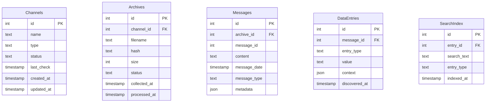

# Database Schema Documentation

## Overview

Telegram Archive Explorer uses SQLite with encryption for data storage. This document details the database schema, relationships, and data flow.

## Schema Diagram



## Table Descriptions

### Channels
Stores information about monitored Telegram channels.

| Column | Type | Description |
|--------|------|-------------|
| id | INTEGER | Primary key |
| name | TEXT | Channel name/identifier |
| type | TEXT | Channel type (public/private) |
| status | TEXT | Monitoring status |
| last_check | TIMESTAMP | Last collection attempt |
| created_at | TIMESTAMP | Record creation time |
| updated_at | TIMESTAMP | Record update time |

### Archives
Tracks downloaded archive files.

| Column | Type | Description |
|--------|------|-------------|
| id | INTEGER | Primary key |
| channel_id | INTEGER | Foreign key to Channels |
| filename | TEXT | Archive filename |
| hash | TEXT | File hash (SHA-256) |
| size | INTEGER | File size in bytes |
| status | TEXT | Processing status |
| collected_at | TIMESTAMP | Download timestamp |
| processed_at | TIMESTAMP | Processing timestamp |

### Messages
Stores extracted messages from archives.

| Column | Type | Description |
|--------|------|-------------|
| id | INTEGER | Primary key |
| archive_id | INTEGER | Foreign key to Archives |
| message_id | INTEGER | Original Telegram message ID |
| content | TEXT | Message content |
| message_date | TIMESTAMP | Original message timestamp |
| message_type | TEXT | Message type |
| metadata | JSON | Additional message metadata |

### DataEntries
Contains extracted data points from messages.

| Column | Type | Description |
|--------|------|-------------|
| id | INTEGER | Primary key |
| message_id | INTEGER | Foreign key to Messages |
| entry_type | TEXT | Data type (url/email/username/password) |
| value | TEXT | Extracted value |
| context | JSON | Surrounding context |
| discovered_at | TIMESTAMP | Extraction timestamp |

### SearchIndex
Optimizes data searching capabilities.

| Column | Type | Description |
|--------|------|-------------|
| id | INTEGER | Primary key |
| entry_id | INTEGER | Foreign key to DataEntries |
| search_text | TEXT | Indexed text |
| entry_type | TEXT | Associated data type |
| indexed_at | TIMESTAMP | Indexing timestamp |

## Indexes

```sql
-- Performance optimization indexes
CREATE INDEX idx_channels_name ON Channels(name);
CREATE INDEX idx_archives_channel ON Archives(channel_id);
CREATE INDEX idx_messages_archive ON Messages(archive_id);
CREATE INDEX idx_dataentries_message ON DataEntries(message_id);
CREATE INDEX idx_dataentries_type ON DataEntries(entry_type);
CREATE INDEX idx_searchindex_text ON SearchIndex(search_text);
```

## Data Flow

1. **Channel Registration**
   - New channels added to Channels table
   - Status tracked for collection scheduling

2. **Archive Collection**
   - Archives downloaded and recorded in Archives table
   - Hash verification prevents duplicates

3. **Message Extraction**
   - Archives processed into Messages table
   - Original message structure preserved

4. **Data Processing**
   - Messages analyzed for relevant data
   - Extracted data stored in DataEntries
   - Search index updated automatically

## Encryption

The database uses SQLite encryption with the following features:
- AES-256 encryption at rest
- Secure key storage
- Transparent encryption/decryption
- Key rotation support

## Maintenance

### Optimization
```sql
-- Regular maintenance queries
VACUUM;
ANALYZE;
REINDEX;
```

### Backup
```sql
-- Backup command
.backup 'backup.db'

-- Integrity check
PRAGMA integrity_check;
```

## Development Guidelines

1. **Data Access**
   - Use prepared statements
   - Implement proper error handling
   - Maintain transaction integrity

2. **Schema Changes**
   - Provide migration scripts
   - Maintain backward compatibility
   - Document changes thoroughly

3. **Performance**
   - Monitor query performance
   - Use appropriate indexes
   - Implement caching where needed

## See Also
- [API Reference](api.md)
- [Data Import/Export](data-operations.md)
- [Security Guidelines](security.md)
